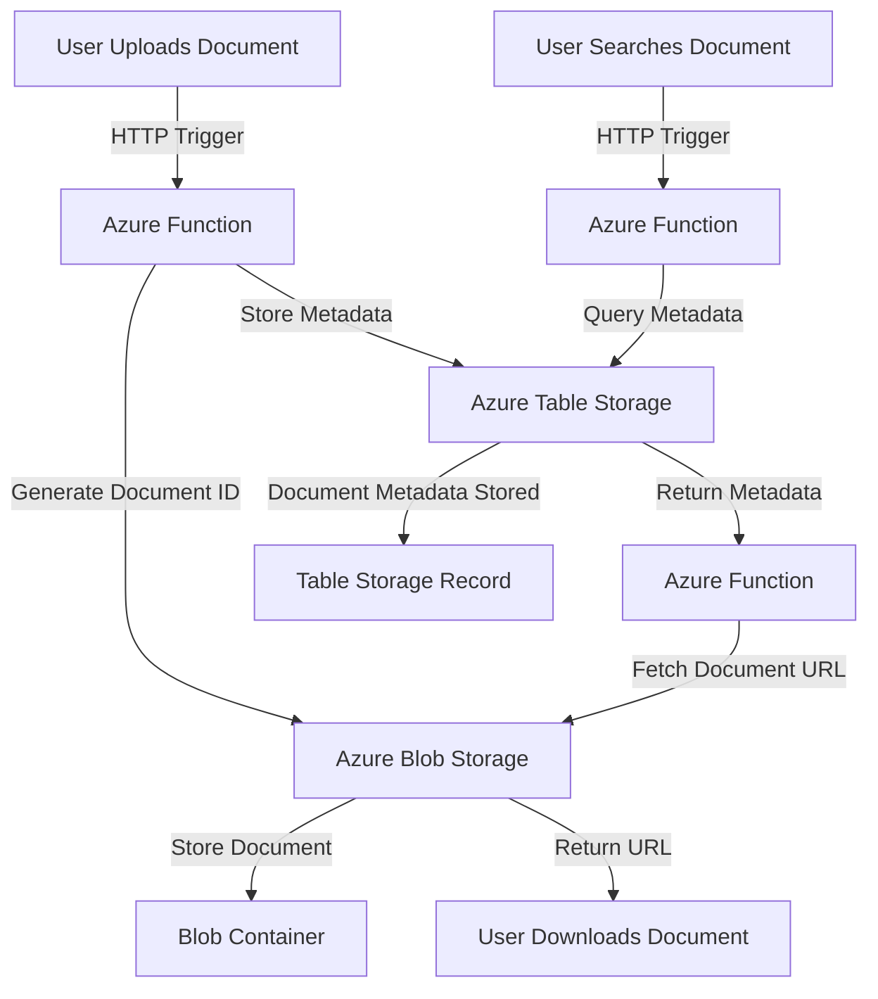

### **Use Case: Document Management System with Azure Functions, Azure Storage, Azure Table Storage, and Azure Blob Container**

#### **Business Scenario**
A mid-sized legal firm needs a **Document Management System (DMS)** to store, organize, and retrieve legal documents securely. The firm handles thousands of legal documents, contracts, and case files daily, requiring a scalable, cost-effective solution. The system should support:

1. **Uploading and categorizing documents**.
2. **Indexing metadata** for quick search and retrieval.
3. **Version control** for document updates.
4. **Access tracking** to ensure security compliance.

### **Solution Overview**

The solution is built using **Azure Functions**, **Azure Blob Storage**, **Azure Table Storage**, and other Azure services to create a serverless, scalable, and cost-efficient document management system.

---

Here is a **Mermaid diagram** for the document management system workflow:



### **Description**
- **Document Upload**:
  - User uploads a document, triggering an Azure Function to store the document in Blob Storage and its metadata in Table Storage.
- **Document Search**:
  - User searches via a query. Azure Function retrieves metadata from Table Storage, fetches the document URL from Blob Storage, and returns it to the user.
- **Periodic Archival**:
  - A Timer Trigger in Azure Function periodically moves old documents to an archive container and updates metadata accordingly.

Let me know if you'd like further customization or a different diagram style!

---
### **Architecture**

1. **Azure Functions**: Handles events such as document uploads, metadata updates, and retrieval requests.
2. **Azure Blob Storage**: Stores the actual document files in blob containers, ensuring scalability and low cost.
3. **Azure Table Storage**: Maintains metadata records (e.g., document name, upload date, version, tags, owner) for fast querying and search.
   
---

### **Workflow**

#### **1. Document Upload Process**
- **Trigger**: User uploads a document via a web or mobile application.
- **Steps**:
  1. The application sends the file to an **Azure Function** using an HTTP trigger.
  2. Azure Function generates a unique **Document ID** and uploads the document to **Azure Blob Storage** in a designated container (e.g., `legal-documents`).
  3. Metadata about the document (e.g., file name, document type, upload timestamp, owner, tags) is stored in **Azure Table Storage** for indexing.
  
---

#### **2. Document Retrieval Process**
- **Trigger**: User searches for a document by metadata (e.g., name, tags, date).
- **Steps**:
  1. A search query is sent to an **Azure Function** via an HTTP trigger.
  2. Azure Function queries **Azure Table Storage** for the metadata that matches the search criteria.
  3. If metadata is found, the corresponding document's URL in **Azure Blob Storage** is retrieved.
  4. The URL is returned to the user for downloading or viewing.

---

#### **3. Document Update and Version Control**
- **Trigger**: User uploads an updated version of an existing document.
- **Steps**:
  1. Azure Function is triggered when a new version of the document is uploaded.
  2. Azure Blob Storage stores the updated document with a versioned filename (e.g., `document-v2.pdf`).
  3. Azure Table Storage metadata is updated with the new version information, including the timestamp and user who performed the update.
  4. Previous versions remain accessible for audit purposes.

---

#### **4. Document Archival and Deletion**
- **Trigger**: Automatic or manual archival of old or unused documents.
- **Steps**:
  1. Azure Function periodically queries **Azure Table Storage** for documents older than a specified threshold.
  2. Identified documents are moved to an **archive container** in **Azure Blob Storage**.
  3. Metadata in **Azure Table Storage** is updated to reflect the new storage location and archival status.

---

### **Key Azure Services**

1. **Azure Functions**:
   - **HTTP Trigger**: For upload, retrieval, and update requests.
     
2. **Azure Blob Storage**:
   - **Blob Containers**: Organize documents by categories (e.g., legal, finance).
   - **Access Tiers**: Use **hot**, **cool**, or **archive** tiers for cost optimization.

3. **Azure Table Storage**:
   - Schema-less storage for metadata, ensuring high scalability and fast access.
   - Example Metadata Schema:
     - PartitionKey: Document category (e.g., `Legal`).
     - RowKey: Unique Document ID.
     - Properties: Document name, tags, owner, upload date, last modified date, version.

---

### **Advantages**
1. **Scalability**: The solution grows seamlessly with the volume of documents.
2. **Cost-Effectiveness**: Pay-as-you-go pricing for Azure services.
3. **Ease of Access**: Metadata indexing allows fast searches.
4. **Serverless Management**: Azure Functions handle all backend processing without manual scaling.
5. **Security**: Azure Blob Storage integrates with Azure AD and RBAC to secure document access.

---

### **Potential Enhancements**
1. **Search Optimization**: Use **Azure Cognitive Search** for advanced search capabilities.
2. **Notifications**: Integrate with **Azure Logic Apps** to send email/SMS alerts for approvals or updates.
3. **Compliance and Auditing**: Use **Azure Monitor** and **Application Insights** to track access and changes.
4. **Integration with Power BI**: Generate reports on document usage and metadata trends.

## Appplication Setting 

> **Note:**  Remote configuration

|Key|Value | Comment|
|:----|:----|:----|
|AzureWebJobsStorage|[CONNECTION STRING]|RECOMMENDATION :  store in Azure Key Vault.|
|ApiStore|Store and manage WorkFlow configuration files remotely  |
|ApiKeyName|[API KEY NAME]|Will be passed in the header  :  the file name of the config.
|AppName| [APPLICATION NAME]| This is the name of the Function App, used in log analytics|
|StorageAcctName|[STORAGE ACCOUNT NAME]|Example  "AzureWebJobsStorage"|
|EncryptionKey|Generate Encryption Key | Generate a encryption key. Store in Azure Key Vault |

> **Note:**  Managed configuration

|Key|Value | Comment|
|:----|:----|:----|
|AzureWebJobsStorage|[CONNECTION STRING]|RECOMMENDATION :  store in Azure Key Vault.|
|ConfigurationPath|Store and manage WorkFlow configuration files remotely  |
|ApiKeyName|[API KEY NAME]|Will be passed in the header  :  the file name of the config.
|AppName| [APPLICATION NAME]| This is the name of the Function App, used in log analytics|
|StorageAcctName|[STORAGE ACCOUNT NAME]|Example  "AzureWebJobsStorage"|
|EncryptionKey|Generate Encryption Key | Generate a encryption key. Store in Azure Key Vault |


> **Note:**  Look at the configuration file in the **Config** Folder and created a Table to record information.

## Configuration Files 

> **Note:** The **Configuration** is located in the  FunctionApp  in a **Config** Folder.

|FileName|Description|
|:----|:----|
|34776F9C03DF46F182084A8B8D2CA9F7.json| **Upload multiple Documents** Write Batched Files To Storage|
|6C58979A27E047DC824BB2DECF9E0BBB.json| **Login** Basic authentication. Optional features(Open ID Connect, and Azure Entra(Formally Active Directory)|
|1E8FA4B3B21044C38DD518A4CFD96C53.json| **Serch all documents for registered users** |
|71F5CECC7D8E4B8890A4380EB01CC173.json| **Registration user** | Basic username and password|
|E655855A45FC4178B4A8E046A147CD94.json| **Retrieve a Document** | Receive JSON payload and insert into NO SQL DB|


> Create the following blob containers and share in azure storage

|ContainerName|Description|
|:----|:----|
|config|**Location for the configuration files** Used for a managed solution|
|documentstore|Store all documents|


> Kusto Queries used for Application Insights

```
search "ReceiveMessageFromServieBus"
| summarize count() by bin(timestamp, 1h)
| order by timestamp desc    

```
```
customEvents
| where isnotnull(customDimensions.ProcessName)
//| where customDimensions.ProcessName == 'ReceiveMessageFromServieBus'  
| summarize count() by bin(timestamp, 1m),  Key = tostring(customDimensions.ProcessName) 
| order by timestamp desc
| render columnchart
``` 
  
  
## Products

|products|links|Comments|
|:----|:----|:----|
|Azure Getting Started |https://azure.microsoft.com/en-us/free/| Create free account + $200 in Credit|
|Sample Data Sets|https://www.kaggle.com/datasets| Useful site for pulling sample payload|
|Azure Storage Explorer|https://azure.microsoft.com/en-us/features/storage-explorer/#features|useful view and query data in azure table storage|
|Postman|https://www.postman.com/downloads/|Postman supports the Web or Desktop Version|
|VsCode| https://visualstudio.microsoft.com/downloads/ |  Required extensions. Azure Functions, Azure Account
|VS Studio Community Edition |https://visualstudio.microsoft.com/downloads/| Recommended. Nice intergration with Azure. software is free.
|Liquid Template|https://liquidjs.com/tutorials/intro-to-liquid.html|

  ## Configuration-driven development
 
 "Configuration-driven development," refers to an approach in software development where the behavior and functionality of an application are primarily controlled through configuration files, rather than writing code. It focuses on separating application logic from configuration parameters, allowing developers to easily modify the behavior of the software without the need for extensive code changes.  [Xenhey.BPM.Core.Net8](https://www.nuget.org/packages/Xenhey.BPM.Core.Net8) offers a orchrestration pipeline using configuration to drive the execution of business logic, providing a tailored solution for each Line Of Business(LOB). The following are some benefits. 

 1. Flexibility: By using configuration files, developers can easily tweak and adjust the application's behavior without modifying the underlying code. It allows for quick customization and adaptation to different scenarios or client requirements.

2. Maintenance: Separating configuration from code simplifies maintenance processes. Updates and modifications can be made by adjusting the configuration files, reducing the risk of introducing bugs or breaking existing functionality. It also facilitates version control and collaboration, as changes to configuration can be tracked separately from code changes.

3. Scalability: Configuration-driven development promotes scalability by enabling the application to handle different environments, configurations, or user preferences. It allows for seamless deployment across multiple instances or environments with minimal code changes.

4. Testing and Validation: Configuration-driven development enhances testing and validation processes. Since configuration changes are isolated from the codebase, it becomes easier to verify the impact of different configurations on the application's behavior. It also facilitates A/B testing or experimentation by quickly switching between different configurations.

5. Domain-Specific Customization: Configuration-driven development enables domain-specific customization by providing options and settings tailored to specific use cases. This empowers non-technical users or administrators to configure the application according to their specific requirements without the need for coding expertise


  ## Contact
  
For questions related to this project, can be reached via email :- support@xenhey.com





