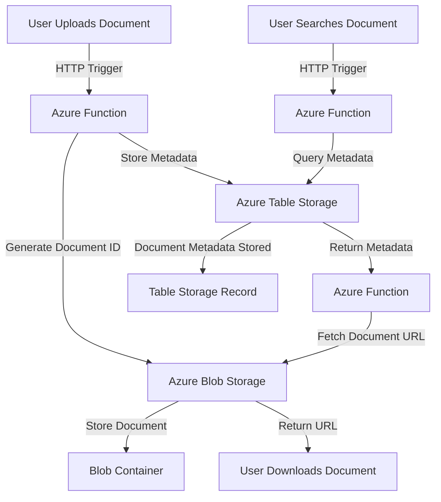

### **Use Case: Document Management System with Azure Functions, Azure Storage, Azure Table Storage, and Azure Blob Container**

#### **Business Scenario**
A mid-sized legal firm needs a **Document Management System (DMS)** to store, organize, and retrieve legal documents securely. The firm handles thousands of legal documents, contracts, and case files daily, requiring a scalable, cost-effective solution. The system should support:

1. **Uploading and categorizing documents**.
2. **Indexing metadata** for quick search and retrieval.
3. **Version control** for document updates.
4. **Access tracking** to ensure security compliance.

### **Solution Overview**

The solution is built using **Azure Functions**, **Azure Blob Storage**, **Azure Table Storage**, and other Azure services to create a serverless, scalable, and cost-efficient document management system.

---

Here is a **Mermaid diagram** for the document management system workflow:

### **Description**
- **Document Upload**:
  - User uploads a document, triggering an Azure Function to store the document in Blob Storage and its metadata in Table Storage.
- **Document Search**:
  - User searches via a query. Azure Function retrieves metadata from Table Storage, fetches the document URL from Blob Storage, and returns it to the user.
- **Periodic Archival**:
  - A Timer Trigger in Azure Function periodically moves old documents to an archive container and updates metadata accordingly.

Let me know if you'd like further customization or a different diagram style!

---
### **Architecture**

1. **Azure Functions**: Handles events such as document uploads, metadata updates, and retrieval requests.
2. **Azure Blob Storage**: Stores the actual document files in blob containers, ensuring scalability and low cost.
3. **Azure Table Storage**: Maintains metadata records (e.g., document name, upload date, version, tags, owner) for fast querying and search.
4. **Azure Queue Storage** (Optional): Handles asynchronous tasks, such as triggering notifications for approvals or archival workflows.

---

### **Workflow**

#### **1. Document Upload Process**
- **Trigger**: User uploads a document via a web or mobile application.
- **Steps**:
  1. The application sends the file to an **Azure Function** using an HTTP trigger.
  2. Azure Function generates a unique **Document ID** and uploads the document to **Azure Blob Storage** in a designated container (e.g., `legal-documents`).
  3. Metadata about the document (e.g., file name, document type, upload timestamp, owner, tags) is stored in **Azure Table Storage** for indexing.
  4. (Optional) Azure Function sends a message to **Azure Queue Storage** to notify approvers or other stakeholders.

---

#### **2. Document Retrieval Process**
- **Trigger**: User searches for a document by metadata (e.g., name, tags, date).
- **Steps**:
  1. A search query is sent to an **Azure Function** via an HTTP trigger.
  2. Azure Function queries **Azure Table Storage** for the metadata that matches the search criteria.
  3. If metadata is found, the corresponding document's URL in **Azure Blob Storage** is retrieved.
  4. The URL is returned to the user for downloading or viewing.

---

#### **3. Document Update and Version Control**
- **Trigger**: User uploads an updated version of an existing document.
- **Steps**:
  1. Azure Function is triggered when a new version of the document is uploaded.
  2. Azure Blob Storage stores the updated document with a versioned filename (e.g., `document-v2.pdf`).
  3. Azure Table Storage metadata is updated with the new version information, including the timestamp and user who performed the update.
  4. Previous versions remain accessible for audit purposes.

---

#### **4. Document Archival and Deletion**
- **Trigger**: Automatic or manual archival of old or unused documents.
- **Steps**:
  1. Azure Function periodically queries **Azure Table Storage** for documents older than a specified threshold.
  2. Identified documents are moved to an **archive container** in **Azure Blob Storage**.
  3. Metadata in **Azure Table Storage** is updated to reflect the new storage location and archival status.

---

### **Key Azure Services**

1. **Azure Functions**:
   - **HTTP Trigger**: For upload, retrieval, and update requests.
     
2. **Azure Blob Storage**:
   - **Blob Containers**: Organize documents by categories (e.g., legal, finance).
   - **Access Tiers**: Use **hot**, **cool**, or **archive** tiers for cost optimization.

3. **Azure Table Storage**:
   - Schema-less storage for metadata, ensuring high scalability and fast access.
   - Example Metadata Schema:
     - PartitionKey: Document category (e.g., `Legal`).
     - RowKey: Unique Document ID.
     - Properties: Document name, tags, owner, upload date, last modified date, version.

---

### **Advantages**
1. **Scalability**: The solution grows seamlessly with the volume of documents.
2. **Cost-Effectiveness**: Pay-as-you-go pricing for Azure services.
3. **Ease of Access**: Metadata indexing allows fast searches.
4. **Serverless Management**: Azure Functions handle all backend processing without manual scaling.
5. **Security**: Azure Blob Storage integrates with Azure AD and RBAC to secure document access.

---

### **Potential Enhancements**
1. **Search Optimization**: Use **Azure Cognitive Search** for advanced search capabilities.
2. **Notifications**: Integrate with **Azure Logic Apps** to send email/SMS alerts for approvals or updates.
3. **Compliance and Auditing**: Use **Azure Monitor** and **Application Insights** to track access and changes.
4. **Integration with Power BI**: Generate reports on document usage and metadata trends.

## Appplication Setting 

|Key|Value | Comment|
|:----|:----|:----|
|AzureWebJobsStorage|[CONNECTION STRING]|RECOMMENDATION :  store in AzureKey Vault.|
|ConfigurationPath| [CONFIGURATION FOLDER PATH] |Folder is optional
|ApiKeyName|[API KEY NAME]|Will be passed in the header  :  the file name of the config.
|AppName| [APPLICATION NAME]| This is the name of the Function App, used in log analytics|
|StorageAcctName|[STORAGE ACCOUNT NAME]|Example  "AzureWebJobsStorage"|
|ServiceBusConnectionString|[SERVICE BUS CONNECTION STRING]|Example  "ServiceBusConnectionString".  Recommmended to store in Key vault.|
|DatabaseConnection|[DATABASE CONNECTION STRING]|Example  "DatabaseConnection". Recommmended to store in Key vault.|
|TimerInterval|[TIMER_INTERVAL]|Example  "0 */1 * * * *" 1 MIN|

> **Note:**  Look at the configuration file in the **Config** Folder and created a Table to record information.

## Configuration Files 

> **Note:** The **Configuration** is located in the  FunctionApp  in a **Config** Folder.

|FileName|Description|
|:----|:----|
|99F77BEF300E4660A63A939ADD0BCF68.json| **Upload File** Parse CSV file --> Write Batched Files To Storage|
|43EFE991E8614CFB9EDECF1B0FDED37A.json| **File Parser** Parse CSV file --> File received from SFTP will use this process to parse files|
|43EFE991E8614CFB9EDECF1B0FDED37D.json| **Upload File** Parse JSON/CSV Directly to NO SQL DB|
|43EFE991E8614CFB9EDECF1B0FDED37C.json| **Service Bus Trigger for SQL DB** | Receive JSON payload and insert into SQL DB|
|43EFE991E8614CFB9EDECF1B0FDED37F.json| **Service Bus Trigger for No SQL DB** | Receive JSON payload and insert into NO SQL DB|
|43EFE991E8614CFB9EDECF1B0FDED37E.json| **Blob Trigger** Send parsed/sharded file  to Send to Service Bus|
|43EFE991E8614CFB9EDECF1B0FDED37B.json| **Search Resullt from NO SQLDB** |
|43EFE991E8614CFB9EDECF1B0FDED37G.json| **Search SQL DB. Return resultset** |
|3FB620B0E0FD4E8F93C9E4D839D00E1E.json| **Copy File from SFTP into the pickup folder** |
|3FB620B0E0FD4E8F93C9E4D839D00E1F.json| **Create a new Record in NoSQL Database** |
|CC244934898F46789734A9437B6F76CA.json| Encode Payload Request |
|6B427917E36A4DA281D57F9A64AD9D55.json| Get reports from DB  |

> Create the following blob containers and share in azure storage

|ContainerName|Description|
|:----|:----|
|config|Location for the configuration files|
|pickup|Thes are files that are copied from the SFTP share and dropped in the pickup container |
|processed|These are files the have been parsed and dropped in th processed container|

|Table|Description|
|:----|:----|
|csvbatchfiles|Track the CSV parsed files|
|training[YYYYMMDD]|N0 SQL DataStore|

